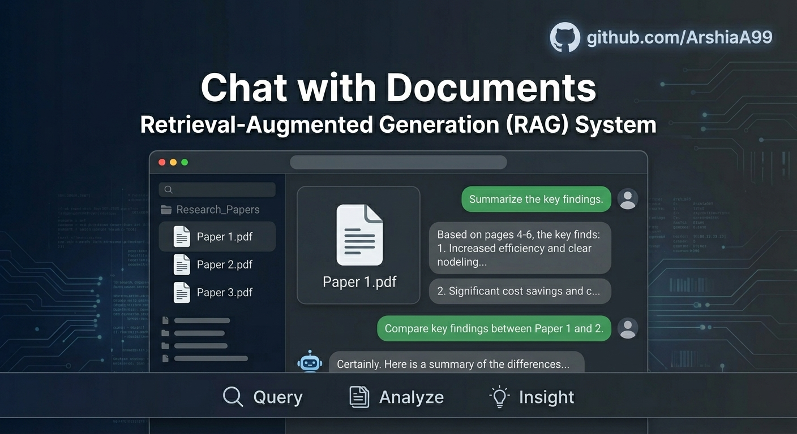

# 📚 Chat With Documents

A production-style Retrieval-Augmented Generation (RAG) application built with FastAPI, ChromaDB, and Llama 3.3. Upload documents, automatically index them into a vector database, retrieve relevant context through semantic search, and generate grounded answers using a large language model.

---

## ✨ Features

* 📄 Upload and index TXT and PDF documents
* 🔍 Semantic search using ChromaDB vector storage
* ✂️ Automatic document chunking with overlap
* 🤖 Llama 3.3-70B inference via Groq
* 📚 Source citations with similarity scores
* 🗄️ Persistent vector database
* 📊 Real-time database statistics
* 🧹 One-click vector index reset
* 🎨 Modern enterprise-style dashboard built with TailwindCSS

---

## Architecture

```text
                  ┌────────────────────┐
                  │  User Uploads File │
                  └─────────┬──────────┘
                            │
                            ▼
                  ┌────────────────────┐
                  │ Document Parser    │
                  │ TXT / PDF Reader   │
                  └─────────┬──────────┘
                            │
                            ▼
                  ┌────────────────────┐
                  │ Text Splitter      │
                  │ RecursiveCharacter │
                  └─────────┬──────────┘
                            │
                            ▼
                  ┌────────────────────┐
                  │ Embedding Model    │
                  │ all-MiniLM-L6-v2   │
                  └─────────┬──────────┘
                            │
                            ▼
                  ┌────────────────────┐
                  │ ChromaDB           │
                  │ Vector Storage     │
                  └─────────┬──────────┘
                            │
               User Query   │
                            ▼
                  ┌────────────────────┐
                  │ Similarity Search  │
                  │ Top-K Retrieval    │
                  └─────────┬──────────┘
                            │
                            ▼
                  ┌────────────────────┐
                  │ Context Injection  │
                  └─────────┬──────────┘
                            │
                            ▼
                  ┌────────────────────┐
                  │ Llama 3.3-70B      │
                  │ via Groq API       │
                  └─────────┬──────────┘
                            │
                            ▼
                  ┌────────────────────┐
                  │ Grounded Answer    │
                  │ + Citations        │
                  └────────────────────┘
```

---

## Tech Stack

| Component        | Technology                      |
| ---------------- | ------------------------------- |
| Backend API      | FastAPI                         |
| Vector Database  | ChromaDB                        |
| Embeddings       | all-MiniLM-L6-v2                |
| LLM              | Llama 3.3 70B Versatile         |
| LLM Provider     | Groq                            |
| Document Parsing | PyPDF                           |
| Chunking         | LangChain Text Splitters        |
| Frontend         | HTML + TailwindCSS + JavaScript |

---

## Project Structure

```text
.
├── app.py
├── vectorstore.py
├── rag.py
├── llm.py
├── requirements.txt
└── README.md
```

### app.py

Main FastAPI application.

Responsibilities:

* Dashboard UI
* File uploads
* Query processing
* Database statistics
* Collection management

### vectorstore.py

Document ingestion pipeline.

Responsibilities:

* PDF/TXT parsing
* Chunk generation
* Metadata enrichment
* Embedding generation
* ChromaDB indexing

### rag.py

Retrieval layer.

Responsibilities:

* Similarity search
* Context assembly
* Citation generation
* Source tracking

### llm.py

Generation layer.

Responsibilities:

* Prompt construction
* Llama 3.3 communication
* Hallucination mitigation
* Answer generation

---

## Installation

### Clone Repository

```bash
git clone https://github.com/ArshiaA99/Chat-With-Documents.git

cd Chat-With-Documents
```

### Create Virtual Environment

```bash
python -m venv venv
```

Windows:

```bash
venv\Scripts\activate
```

Linux / macOS:

```bash
source venv/bin/activate
```

### Install Dependencies

```bash
pip install -r requirements.txt
```

---

## Environment Variables

Create a `.env` file:

```env
GROQ_API_KEY=your_api_key_here
```

Or export manually:

Linux/macOS:

```bash
export GROQ_API_KEY=your_api_key_here
```

Windows PowerShell:

```powershell
$env:GROQ_API_KEY="your_api_key_here"
```

---

## Running the Application

```bash
python app.py
```

Open:

```text
http://127.0.0.1:8000
```

---

## How It Works

### Step 1 — Upload Documents

Supported formats:

* TXT
* PDF

Documents are parsed and chunked into smaller semantic segments.

### Step 2 — Index Creation

Each chunk:

* Receives metadata
* Gets embedded into vector space
* Is stored inside ChromaDB

### Step 3 — Ask Questions

Example:

```text
Who was Joseph Stalin?
```

### Step 4 — Context Retrieval

Top 3 relevant chunks are retrieved using cosine similarity search.

### Step 5 — Grounded Generation

Retrieved context is injected into Llama 3.3.

The model is instructed:

```text
Use ONLY the provided context.

If information is unavailable:
"I don't know based on the provided context."
```

This significantly reduces hallucinations.

---

## Example Response

### User Query

```text
What caused the collapse of the Soviet Union?
```

### Retrieved Sources

```text
- ussr.txt [Chunk Index: 4]
- ussr.txt [Chunk Index: 7]
- ussr.txt [Chunk Index: 9]
```

### Generated Answer

```text
The Soviet Union collapsed due to economic stagnation,
political reforms, and increasing nationalist movements,
according to the retrieved documents.
```

---

## Metadata Support

The ingestion pipeline can enrich documents with metadata.

Example:

```python
metadata_map = {
    "ww2.txt": {
        "topic": "war",
        "keywords": "history, fascism, nazism, hitler"
    }
}
```

Stored metadata includes:

```text
source
page
document_id
chunk_index
topic
keywords
```

---

## API Endpoints

### Dashboard

```http
GET /
```

Returns the web interface.

### Upload Documents

```http
POST /upload
```

### Ask Question

```http
POST /ask
```

### Database Statistics

```http
GET /stats
```

### Reset Vector Store

```http
POST /clear-db
```

---

## Security & Hallucination Control

The LLM receives the following constraints:

* Use retrieved context only
* Do not rely on external knowledge
* Return a fallback response when information is missing
* Temperature fixed at 0.0

This creates a deterministic retrieval-first workflow suitable for internal knowledge bases.


---


## License

MIT License

---

## Author

**Arshia Karkhanehie**
